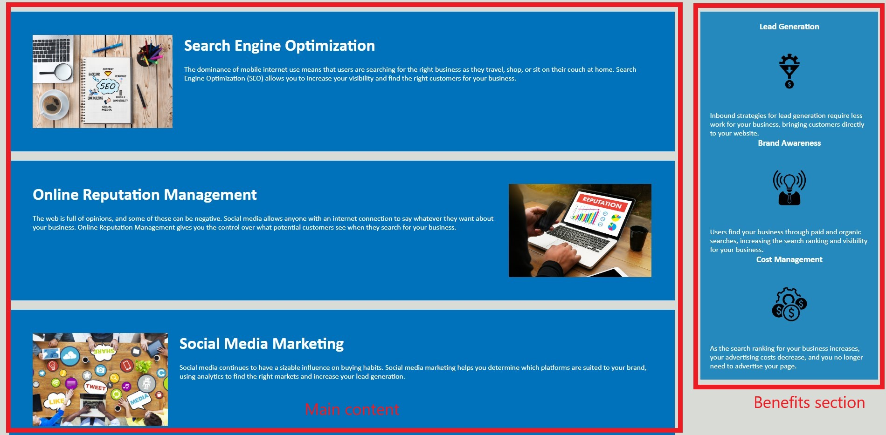

# Horiseon Webpage

## Description

Horiseon is an online social media manegement company that helps businesses navagiate and optimize their online presence to maximize visibility and find the right customers. Through services like Search Engine Optimization, Online Reputation Management, and Social Media Marketing, Horiseon strtegically brings customers organically to your business while boosting your search ranking thereby saving you time and money.

## Usage

This user friendly web application can be navigated with your mouse's scroll wheel or by clicking one of the links at the top right of the page. This will activate an internal link bringing you to the topic of your choice.

Once you scroll down, you will notice the main content is located on the left of the page while the right tells you about the benefits of the services.

## Credits

N/A

## License

Please refer to the LICENSE in the repo,

## Features

Added a media screen query at the bottom of the CSS that sets a max width before the page collapses.
This allows the navigation bar to neatly rest under the h1 header at a certain width and stacks when the width is the size of a mobile device.
The media query also expands the content section and stacks the side bar right below making it easier to view on smaller screens. 

